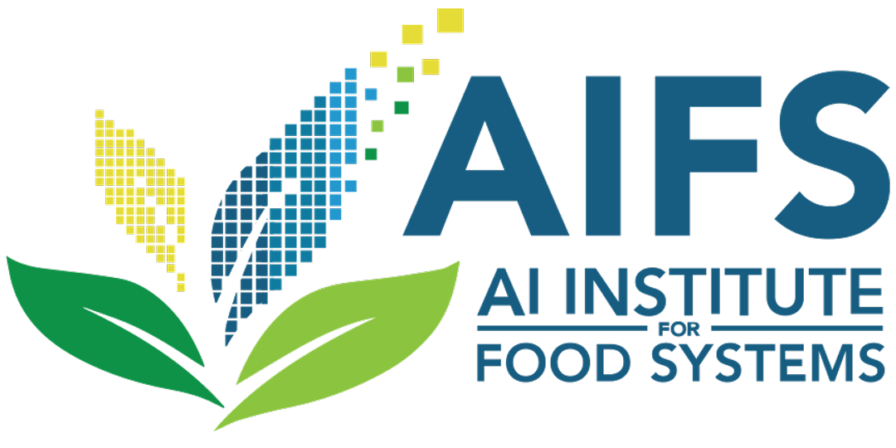

 

### Prize Money via AI Institute for Food Systems (AIFS)
1st prize: $2500, 2nd prize: $1000, 3rd prize: $500 (for each challenge)

### AgML Crop Detection Generalizability Challenge
Participants will be provided 6 to 8 image-based crop detection datasets from [AgML](https://github.com/Project-AgML/AgML){:target="_blank"} for model training, with an additional 4 to 6 datasets held out for model evaluation (~10,000 images total). Each dataset will be contain a different fruit, vegetable, or nut imaged in an agricultural environment using various camera types, viewpoints, and lighting conditions. The goal of this challenge is create a crop detection model that generalizes well to out-of-distribution crop types and imaging conditions. A "generalizability" evaluation metric will be defined as the mean average precision @ [0.5 : 0.95] averaged across all test datasets.

### AgML Syn2Real Crop Detection Data Efficiency Challenge
Participants will be provided synthetic crop detection image datasets for model training (via [AgML](https://github.com/Project-AgML/AgML){:target="_blank"}’s Helios synthetic data generation API), and a small subset of real world data from the same crop type. The objective for this challenge is to train a high performing real crop object detection model while fixing the number of real images available during training (i.e. 5, 10, or 20). A ”data efficiency” evaluation metric will be defined as the mean average precision @ [0.5 : 0.95] on a held out set of real crop images averaged across models trained with a fixed set of 5, 10, or 20 real images.
