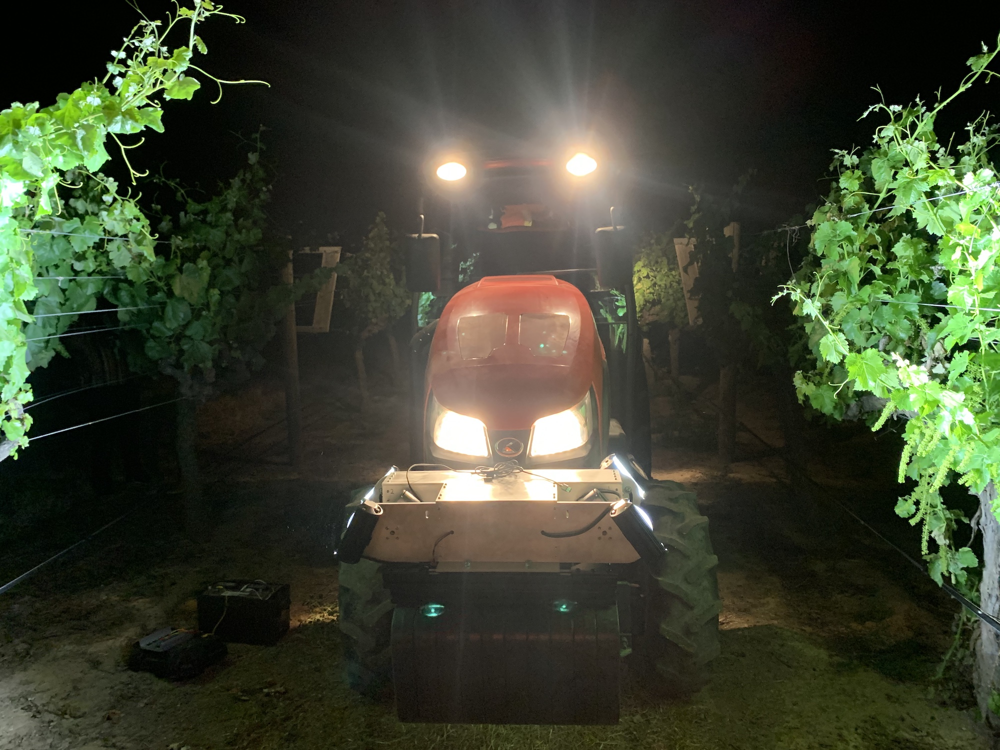

The Plant AI and Biophysics Lab (PAIBL) aims to develop low-cost AI systems that generate novel insight into plant biology, ultimately leading to more precise and sustainable agricultural practice. A major emphasis in the lab is to build agricultural sensing and automation systems powered by deep learning algorithms that can precisely monitor and predict plant biophysical status, such as stress, productivity, and yield. At the same time, we want to push our AI systems beyond black-box prediction and toward interpretability of biological mechanism. Thus, we also investigate basic plant biophysical mechanisms from molecular- to organismal-levels to understand scalability and impact on agricultural systems.